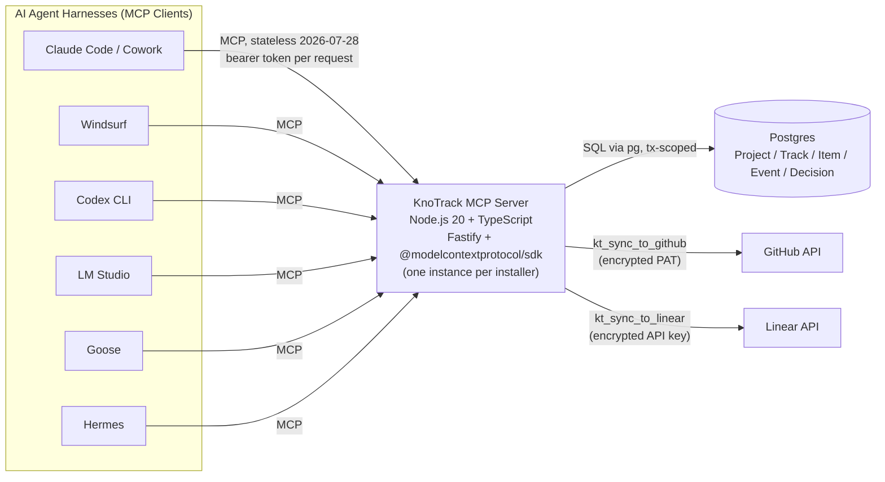
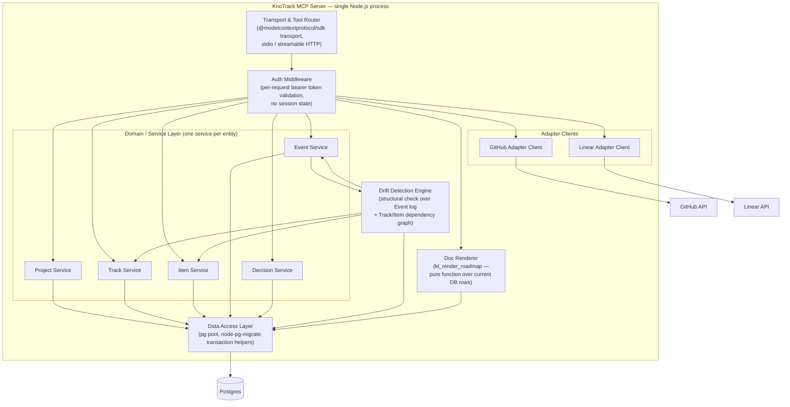
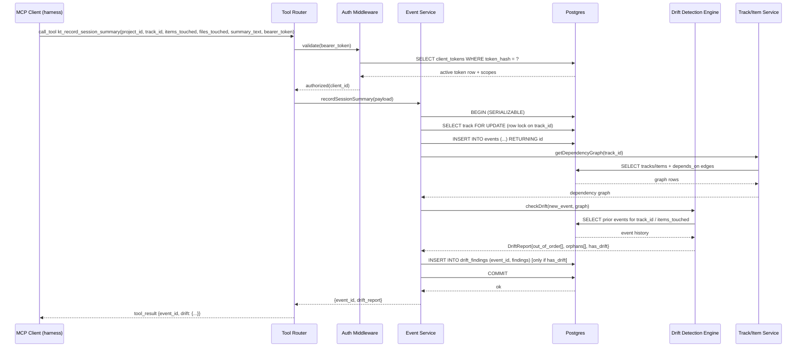
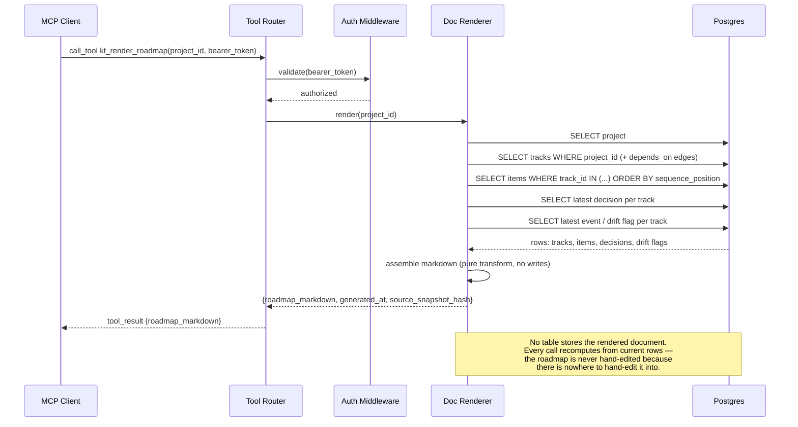
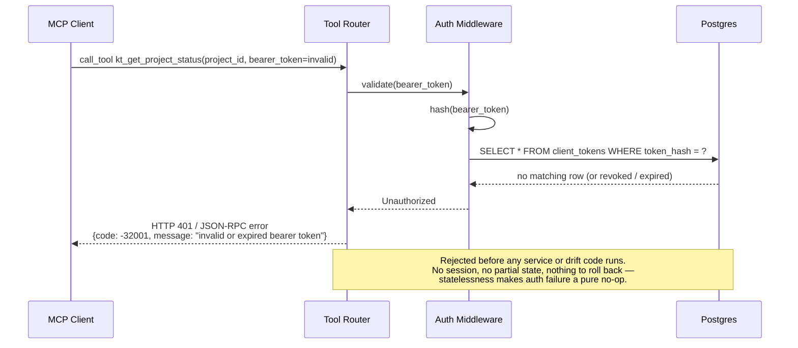
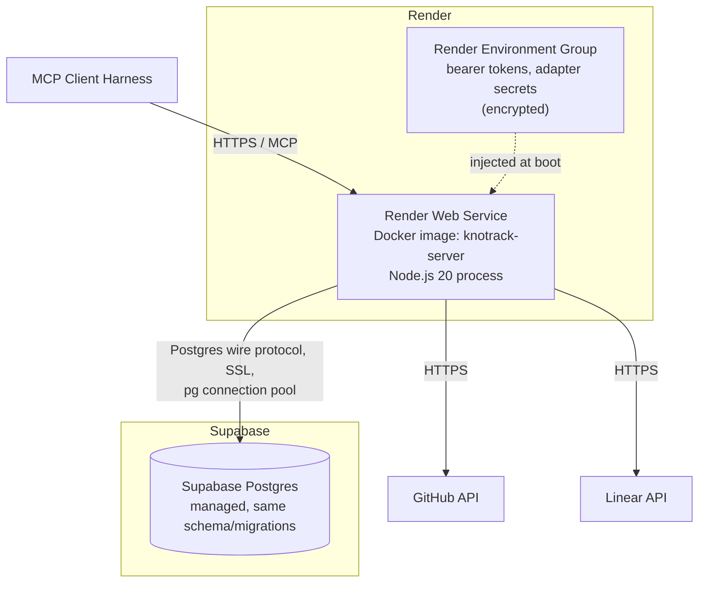
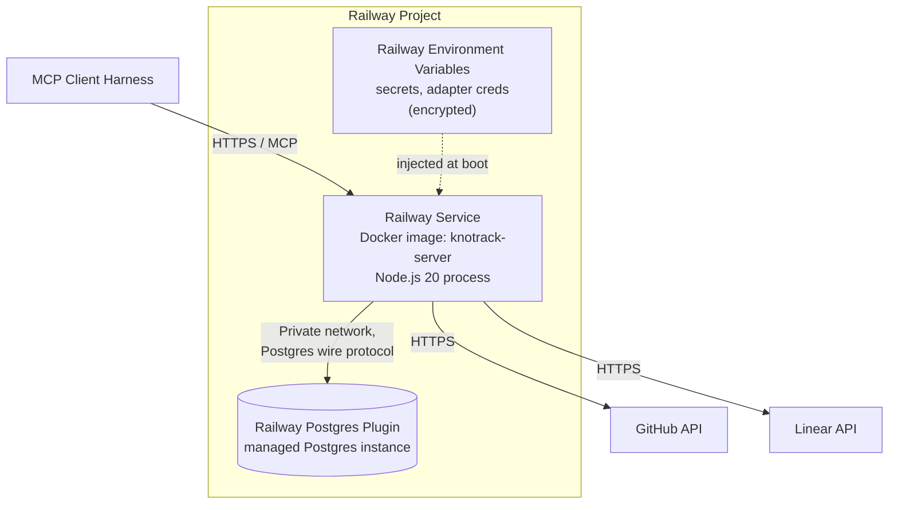
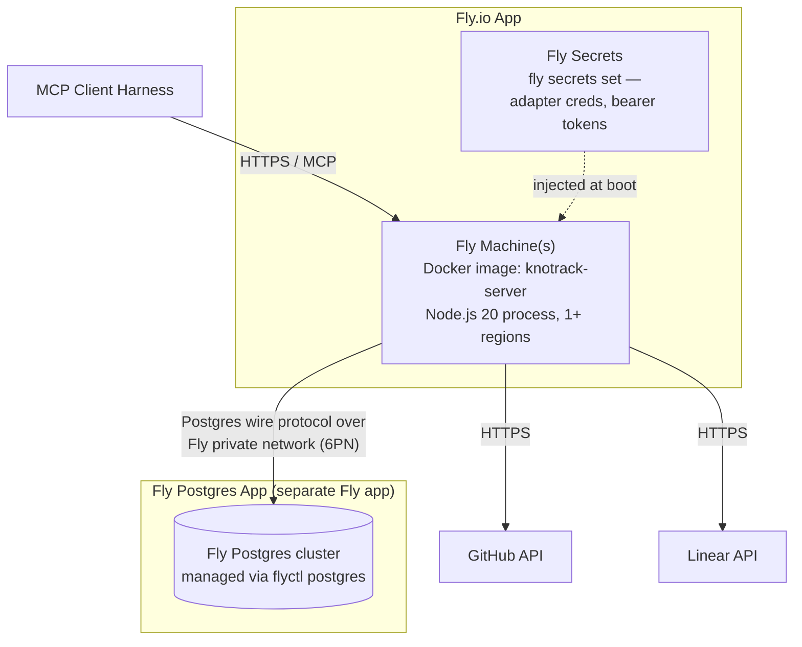

# KnoTrack — Solution Design (ARCHITECTURE.md)

KnoTrack is a **self-hosted, single-tenant MCP server** for project-management
workflow (status, sequencing, drift detection) that many different AI agent
harnesses talk to over the Model Context Protocol. There is no central
multi-tenant service: every installer runs their own instance, pointed at
their own Postgres database, holding their own adapter credentials.

KnoTrack targets the **stateless 2026-07-28 MCP spec**: the server keeps no
server-side session memory between calls. Every tool call is a fully
self-contained request carrying explicit IDs (`project_id`, `track_id`,
`item_id`, …). This is a load-bearing constraint on the whole design — see
[§6](#6-why-this-cannot-become-an-orchestrator-by-accident) for why it also
keeps KnoTrack from ever becoming a work-dispatching orchestrator.

**Stack:** Node.js 20 + TypeScript, `@modelcontextprotocol/sdk`, Fastify,
Postgres via `pg` + `node-pg-migrate`.

**Deploy targets (identical architecture on all three):** Render + Supabase,
Railway + Postgres, Fly.io + Postgres. Same Docker image, same Node process,
same schema/migrations — the only thing that differs is *where* compute and
Postgres are provisioned.

---

## 1. System Context



Key properties visible at this level:

- **Fan-in, not fan-out**: six different harness ecosystems converge on one
  MCP surface; KnoTrack does not know or care which harness is calling, only
  which bearer token it presented.
- **Single source of truth**: Postgres is the only durable state. GitHub and
  Linear are *targets* KnoTrack pushes summaries to, never sources it reads
  authority from.
- **No inter-installer traffic**: nothing here talks to any other KnoTrack
  instance. Each box in "Postgres" is one installer's private database.

---

## 2. Component Diagram (server internals)



Notes on the module boundaries:

- **Transport & Tool Router** owns MCP protocol framing and dispatches each
  of the 13 tools to exactly one service method. It holds no business logic.
- **Auth Middleware** sits between the router and every service — it is not
  optional per-tool, it is structurally in the path for all 13 tools.
- **Domain/Service Layer** is one service per entity (Project, Track, Item,
  Event, Decision) so a schema or rule change to one entity never leaks into
  another's code path.
- **Drift Detection Engine** is a standalone module, not a method hanging off
  Event Service, because it is invoked from two call sites: inline from
  `kt_record_session_summary` and standalone from `kt_check_drift`. It reads
  the dependency graph and event history; it never mutates Track/Item rows,
  only writes drift findings tied to the triggering event.
- **Doc Renderer** depends only on the Data Access Layer, never on the
  service layer's in-memory objects, so `kt_render_roadmap` is guaranteed to
  reflect committed DB state and nothing else — see §3b.
- **Adapter Clients** are the only modules with outbound internet calls
  besides Postgres. They are invoked directly by the router (via auth), not
  by the domain services, so a GitHub/Linear outage cannot block a write to
  Postgres.

---

## 3. Sequence Diagrams

### 3a. `kt_record_session_summary` end-to-end, including inline drift check



The row lock (`SELECT ... FOR UPDATE`) is acquired **before** the drift
computation reads item/event state, so drift always evaluates against a
consistent, non-racing snapshot — detailed in §7.

### 3b. `kt_render_roadmap` generating a document from current DB state



### 3c. Bearer-token auth check on a rejected (401) request



---

## 4. Deployment Architecture

All three targets run the **same Docker image** and the **same Node.js
process** (one Fastify HTTP listener speaking MCP + a health endpoint). Only
the placement of compute and Postgres changes.

### 4a. Render + Supabase



### 4b. Railway + Postgres



### 4c. Fly.io + Postgres



**Why identical is achievable:** the process reads its Postgres connection
string and adapter secrets from environment variables only; it makes no
assumption about the platform it runs on (no Render-specific or Fly-specific
SDK calls, no reliance on a platform's native cron/queue). `node-pg-migrate`
runs the same migration set against whichever Postgres the connection string
points at. Swapping deploy target is a matter of re-pointing `DATABASE_URL`
and re-running migrations, not a code change.

---

## 5. Drift Detection Algorithm

Drift detection is **structural and server-computed** — it never asks an LLM
whether something looks wrong; it walks the declared dependency graph
against the append-only Event log. It runs from two call sites
(`kt_record_session_summary` inline, and `kt_check_drift` standalone) against
the same function.

```text
# Inputs:
#   track_id        — the track this check is scoped to
#   new_event       — Event{ id, track_id, items_touched: [item_id],
#                             files_touched: [path], created_at }
#                      (null for a standalone kt_check_drift call —
#                      in that case the check runs over the whole
#                      committed event log instead of one new event)
#   graph           — declared structure, loaded fresh from Postgres:
#                       tracks:  Track{ id, depends_on: [track_id] }
#                       items:   Item{ id, track_id, sequence_position,
#                                      depends_on: [item_id] }
#   event_log       — all committed Events for track_id, ordered by
#                      created_at (append-only, never mutated)

function checkDrift(track_id, new_event, graph, event_log) -> DriftReport:

    findings = { out_of_order: [], orphans: [], has_drift: false }

    # ---- Precompute completion state from the Event log ----
    # An item is "done" once some Event recorded a status_transition to
    # 'done' for it. This is derived, not stored redundantly.
    completed_items = set()
    for ev in event_log:
        if ev.status_transition == 'done' and ev.item_id is not None:
            completed_items.add(ev.item_id)

    events_to_check = [new_event] if new_event is not None else event_log

    for ev in events_to_check:

        # ---- Check (a): item touched out of declared dependency order ----
        for item_id in ev.items_touched:
            item = graph.items.get(item_id)
            if item is None:
                continue   # unknown item_id — surfaces via orphan check below

            # (a-i) explicit item-level dependency edges
            for dep_id in item.depends_on:
                if dep_id not in completed_items:
                    findings.out_of_order.append({
                        event_id: ev.id,
                        item_id: item_id,
                        violated_dependency: dep_id,
                        reason: "item touched before its declared "
                                "dependency was marked done"
                    })

            # (a-ii) track-level dependency edges (this item's track
            # depends on another track that isn't fully done yet)
            owning_track = graph.tracks.get(item.track_id)
            for dep_track_id in owning_track.depends_on:
                if not allItemsDone(dep_track_id, graph, completed_items):
                    findings.out_of_order.append({
                        event_id: ev.id,
                        item_id: item_id,
                        violated_dependency_track: dep_track_id,
                        reason: "item touched while an upstream track "
                                "dependency is still incomplete"
                    })

            # (a-iii) sequence_position ordering within the same track:
            # touching item N while an earlier-sequenced, still-open
            # item M < N exists in the same track is drift even absent
            # an explicit depends_on edge, because sequence_position IS
            # the declared order.
            earlier_open = [
                other for other in graph.items.values()
                if other.track_id == item.track_id
                   and other.sequence_position < item.sequence_position
                   and other.id != item_id
                   and other.id not in completed_items
            ]
            if earlier_open:
                findings.out_of_order.append({
                    event_id: ev.id,
                    item_id: item_id,
                    skipped_items: [o.id for o in earlier_open],
                    reason: "touched an item ahead of earlier, still-open "
                            "items in this track's sequence_position order"
                })

        # ---- Check (b): orphan work — files touched with no matching Item ----
        # A file is "matched" if it appears in files_touched on the SAME
        # event alongside an items_touched entry for an item declared in
        # this track. If a file is touched in a track's session but no
        # item_touched in that same event maps to any Item in the track
        # at all, it's orphan work — implicit scope with no declared unit.
        if len(ev.items_touched) == 0 and len(ev.files_touched) > 0:
            for file_path in ev.files_touched:
                findings.orphans.append({
                    event_id: ev.id,
                    file_path: file_path,
                    reason: "files touched in this track's session with "
                            "no corresponding Item recorded on the event"
                })
        else:
            declared_ids = set(ev.items_touched) & set(graph.items.keys())
            if len(declared_ids) == 0 and len(ev.files_touched) > 0:
                for file_path in ev.files_touched:
                    findings.orphans.append({
                        event_id: ev.id,
                        file_path: file_path,
                        reason: "items_touched referenced no Item that "
                                "exists in this track — files have no "
                                "declared home"
                    })

    findings.has_drift = (len(findings.out_of_order) > 0
                           or len(findings.orphans) > 0)
    return findings
```

Properties worth calling out:

- **No heuristics, no ML** — every finding traces to a specific row
  (`Item.depends_on`, `Item.sequence_position`, `Track.depends_on`, or an
  `Event` with `items_touched`/`files_touched`).
- **Idempotent and replayable** — because it's a pure function of
  `(new_event, graph, event_log)`, `kt_check_drift` run standalone against
  the full log produces the same findings the inline check would have
  produced at the time, which is what makes it safe to re-audit history.
- **Append-only inputs** — the Event log is never mutated or deleted, so a
  drift finding is always reproducible later for audit, and re-running drift
  detection can never "erase" evidence of a past violation.

---

## 6. Why This Cannot Become an Orchestrator by Accident

**Tool classification:**

| Read / advisory (no mutation of Track/Item/Project state) | Write (explicit, ID-scoped mutation) |
|---|---|
| `kt_get_project_status` | `kt_register_project` |
| `kt_list_tracks` | `kt_create_track` |
| `kt_get_track` | `kt_create_item` |
| `kt_get_next_steps` | `kt_record_session_summary` |
| `kt_check_drift`\* | `kt_record_decision` |
| `kt_render_roadmap` | `kt_update_item_status` |
| | `kt_sync_to_github` |
| | `kt_sync_to_linear` |

\* `kt_check_drift` may persist a `drift_findings` row tied to the event it
inspected, but it never touches `Track`, `Item`, or assignment state — it
records an observation, not a decision.

**Why `kt_get_next_steps` returning a ranked list is not dispatch:**

- It computes a ranking (by `sequence_position`, unmet `depends_on` edges,
  and current item status) and **returns it as data** in the tool result.
  It does not write anything, does not call any other KnoTrack tool, and
  does not notify, message, or invoke any agent, harness, or external
  system.
- There is no tool, table, or field anywhere in the schema that represents
  "this item is assigned to this agent/session." Nothing in the data model
  can even express an assignment, so no code path could accidentally create
  one.
- Because the protocol is the **stateless 2026-07-28 MCP spec**, KnoTrack
  holds no session memory between calls. It cannot maintain an internal
  work queue, cannot remember "I already told someone to do this," and has
  no mechanism to push follow-up work — every call starts from zero and
  ends when its response is returned.
- The server has **no scheduler, no cron, no webhook-out, no queue
  consumer, and no outbound call that targets an agent**. Its only two
  outbound integrations (`kt_sync_to_github`, `kt_sync_to_linear`) push
  human-readable status to project-tracking *systems*, not instructions to
  *agents* — and those, too, are explicit write tools a client must call,
  not something the server triggers on its own.
- No tool calls another tool. The Tool Router dispatches exactly one tool
  per client request to exactly one service method; there is no internal
  "and then call X" chaining logic anywhere in the component diagram in
  §2 — the only cross-module call inside a single request is
  `kt_record_session_summary` invoking the Drift Detection Engine inline,
  and that produces a report in the same response, not a new action.

In short: orchestration requires the server to *initiate* action or *hold*
a plan of future action across calls. KnoTrack can do neither — it has no
memory between calls and no primitive that represents "do this next,"
only one that represents "here is what I observe, ranked."

---

## 7. Failure-Mode Notes

### Postgres unreachable

- The `pg` pool's health check fails; Fastify's `/healthz` endpoint reports
  unhealthy so platform-level restarts/alerts (Render/Railway/Fly health
  checks) can react.
- Every tool that touches the DB — which is all 13 — returns a structured
  MCP tool error (JSON-RPC error object, HTTP 503) rather than crashing the
  process or hanging the request. The pool is configured with a bounded
  connection-acquire timeout so a request fails fast instead of queuing
  indefinitely.
- Because the server holds no in-memory session state (stateless spec), a
  failed write is simply a failed write — there is no queued mutation to
  lose or corrupt, and nothing to reconcile on reconnect. The client (agent
  harness) is responsible for retrying the same tool call, which is safe
  because writes are scoped to explicit IDs and, for `kt_record_session_summary`,
  guarded by a unique constraint on a client-supplied idempotency key so a
  retried call cannot double-insert the same Event.
- No write tool partially commits: every multi-statement mutation
  (see §3a) runs inside a single Postgres transaction, so an outage mid-way
  through a transaction rolls back cleanly with nothing persisted.

### An adapter call fails (GitHub or Linear unreachable/erroring)

- `kt_sync_to_github` / `kt_sync_to_linear` wrap the external HTTP call with
  a bounded retry (fixed attempt count, exponential backoff) inside the
  Adapter Client, entirely separate from Postgres transactions.
- Adapter failure **never rolls back or blocks** core KnoTrack state — the
  Project/Track/Item/Event/Decision tables are the source of truth and are
  written (if at all) independently of adapter success. A sync attempt's
  outcome (success, failed, retrying, last error) is recorded in a
  `sync_log`/attempt row keyed by the target adapter and external ID
  mapping, so failures are visible and auditable, not swallowed.
- The tool result surfaces the failure explicitly to the caller (it is not
  silently retried forever or dropped); since `kt_sync_to_github`/
  `kt_sync_to_linear` are ordinary write tools, the calling agent can simply
  invoke the same tool again later — sync is upsert-by-external-ID, so a
  retry is idempotent rather than creating duplicate GitHub issues / Linear
  tickets.
- Adapter credentials failing to decrypt or being revoked is treated the
  same way: a scoped adapter error returned from that one tool call, with
  no effect on any other tool.

### Two agents call `kt_record_session_summary` concurrently for the same track

This is the concurrency case that must not corrupt sequencing, and it is
handled with **Postgres row-level locking plus a serializable transaction**,
concretely:

1. Both requests open a transaction (`BEGIN ISOLATION LEVEL SERIALIZABLE`).
2. Each transaction's first statement against the track is
   `SELECT * FROM tracks WHERE id = $1 FOR UPDATE` — a row-level lock on the
   specific track being reported on. Postgres's lock manager admits the
   first transaction to acquire it and blocks the second at that statement.
3. The winning transaction inserts its `Event`, loads the dependency graph,
   runs the Drift Detection Engine (§5) against the state as of that lock
   acquisition, writes any `drift_findings`, and commits — releasing the
   lock.
4. The second transaction, having been blocked at `FOR UPDATE`, now
   proceeds against the **post-commit** state: it sees the first event
   already in the log and any item-status transitions it caused. Its own
   drift check therefore evaluates against up-to-date completion state, so
   the two Events are effectively serialized end-to-end for that track —
   never interleaved.
5. If Postgres instead raises a serialization failure (SQLSTATE `40001`,
   possible if the two transactions also touch overlapping rows outside the
   locked track, e.g. a shared cross-track dependency), the Event Service
   catches that specific error code and retries the whole transaction once
   or twice with jittered backoff before surfacing an error to the client —
   the same pattern used for any other tool.
6. Because the lock scope is a single `track_id` row, concurrent session
   summaries for **different** tracks are unaffected and proceed in
   parallel — the design serializes exactly the contention that matters
   (writers to the same track's sequencing) and nothing more.
7. Event ordering itself is derived from a `bigserial`/`created_at` column
   assigned at insert time inside the lock, so "which event happened first"
   for drift purposes is never ambiguous even under this concurrency.

This requires no distributed lock manager or external coordination service:
a single Postgres instance already serializes correctly via native row
locks, which is sufficient because KnoTrack is single-tenant/self-hosted —
there is exactly one Postgres to coordinate against per installation.
