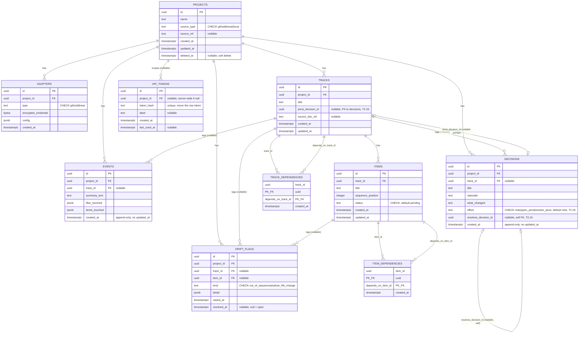

# KnoTrack Database Schema

KnoTrack is a self-hosted, Postgres-backed MCP server. This document describes the
schema created by [`migrations/001_init.sql`](../migrations/001_init.sql) (reversed by
[`migrations/001_init.down.sql`](../migrations/001_init.down.sql)), as amended by later
migrations — most significantly
[`migrations/006_derived_track_status.sql`](../migrations/006_derived_track_status.sql)
(T2.16), which drops the stored `tracks.status` column in favor of a derived-at-read-time
view; see the `tracks` and `decisions` table entries and the new
[`track_readiness` view](#view-track_readiness) below.

- Engine: PostgreSQL 13+
- Migration tool: a small custom runner (`scripts/migrate.ts`) over plain numbered
  raw-SQL files (`001_init.sql` / `001_init.down.sql` is one up/down migration pair) —
  not `node-pg-migrate`; an earlier draft of this doc named that tool, but it was never
  added as a project dependency. See `docs/TRD.md` §1 and `scripts/migrate.ts`'s header
  comment for why.
- Primary keys: `uuid`, generated with `gen_random_uuid()` (from the `pgcrypto`
  extension, enabled by the migration)
- Timestamps: `timestamptz`, `created_at`/`updated_at` default to `now()`

## Contents

- [Entity-relationship diagram](#entity-relationship-diagram)
- [Cross-cutting decisions](#cross-cutting-decisions)
  - [Enum vs. text + CHECK](#enum-vs-text--check)
  - [Soft delete vs. hard delete for projects](#soft-delete-vs-hard-delete-for-projects)
  - [Append-only tables](#append-only-tables)
- [Table reference](#table-reference)

## Entity-relationship diagram



Notes on the diagram:

- `TRACK_DEPENDENCIES` and `ITEM_DEPENDENCIES` are self-referential join tables (a
  track/item can depend on another track/item of the same kind). Mermaid's `erDiagram`
  can't natively draw a table referencing the *same* entity twice with different
  meanings on a single relationship line, so each is shown as two labeled edges
  (`track_id` and `depends_on_track_id`) into the same join table.
- Every edge from `PROJECTS`/`TRACKS`/`ITEMS` into a dependent table is drawn `||--o{`
  (one-to-many, child side optional) because a project/track/item can have zero
  matching child rows.

## Cross-cutting decisions

### Enum vs. text + CHECK

Every enumerated column (`source_type`, `adapters.type`, `items.status`,
`decisions.effect`, `drift_flags.kind`) is implemented as **`text` with a `CHECK`
constraint**, not a native Postgres `CREATE TYPE ... AS ENUM`. This choice is applied
consistently across the whole schema. Reasoning:

- **Adding a new value is a plain, transaction-safe `ALTER TABLE ... DROP CONSTRAINT /
  ADD CONSTRAINT`.** Adding a value to a native enum (`ALTER TYPE ... ADD VALUE`) could
  not run inside the same transaction as other DDL on older Postgres versions (pre-12)
  and still cannot be rolled back within the transaction that added it on any version —
  a real hazard for a migration tool that wraps each migration in a transaction.
- **`scripts/migrate.ts` and most Postgres client libraries (`pg`, `node-postgres`) return
  enum values as plain strings anyway**, so there's no type-safety loss in application
  code — the CHECK constraint gives the same runtime guarantee at the database layer.
- **Simpler tooling story**: introspection, ORMs, and ad-hoc `psql`/GUI clients treat
  `text` uniformly; native enums require special-casing in schema-diffing and
  code-generation tools.
- The tradeoff accepted: a `CHECK` constraint doesn't restrict values already stored in
  a column the way a `USING` cast to an enum type would, and it's marginally less
  compact on disk (`text` vs. the 4-byte enum OID reference). Neither matters at
  KnoTrack's expected scale (single self-hosted deployment per team).

### Soft delete vs. hard delete for projects

**Tension:** Every project-owned child table (`adapters`, `tracks`, `items`, `events`,
`decisions`, `api_tokens`, `drift_flags`) declares `project_id ... ON DELETE CASCADE`,
so that referential integrity is trivial to maintain and a hard `DELETE FROM projects
WHERE id = ...` never leaves orphaned rows. But `events` and `decisions` are explicitly
meant to be an **audit trail** — and a cascading hard delete would make that history
vanish irreversibly along with the project, which defeats the point of keeping it.

**Resolution:** `projects` has a nullable `deleted_at timestamptz` column.
KnoTrack's application code treats "deleting a project" as `UPDATE projects SET
deleted_at = now() WHERE id = ...`, never as a hard `DELETE`, in normal operation:

- All read paths (`kt_get_project_status` and friends) filter `WHERE deleted_at IS
  NULL` (a partial index, `idx_projects_not_deleted`, keeps that filter cheap).
- Audit history (events, decisions) survives a project's soft delete unconditionally,
  because no row is ever removed — it just becomes unreachable through the normal
  "list active projects" path.
- A soft-deleted project can be restored by clearing `deleted_at`, with its full
  history intact.
- The `ON DELETE CASCADE` foreign keys still exist and still work — they are the
  correct behavior for the *rare, deliberate* hard delete: an admin script or an
  operator satisfying a legal erasure request (e.g. GDPR Article 17), where actually
  destroying the audit trail is the intended, informed outcome, not an accident of
  routine project cleanup. That path is intentionally not exposed as a normal MCP tool
  call.

In short: **the schema is built to support hard delete (for the rare case where it's
truly wanted), but the application layer never uses it for routine deletion** — routine
deletion is soft, via `deleted_at`.

### Append-only tables

`events` and `decisions` are append-only by convention: KnoTrack's application code
never issues `UPDATE` against these tables (only `INSERT` and `SELECT`), which is why
neither table has an `updated_at` column — there is nothing to represent, and a
present-but-always-null `updated_at` would misleadingly imply mutability.

This is enforced by convention plus code review, not by the schema itself, because the
default application role (managed via `scripts/migrate.ts`, not `node-pg-migrate`) needs `UPDATE` for the rest of the schema and
Postgres privileges are granted per-table, not per-statement-in-application-code. For a
deployment that wants the invariant enforced at the database level (e.g. to limit the
blast radius of a bug or a compromised application credential), revoke `UPDATE` on
these two tables from the role the application connects as:

```sql
REVOKE UPDATE ON events, decisions FROM knotrack_app;
```

(Substitute your actual application role name. This statement is documented here and
left commented out in `001_init.sql` rather than executed unconditionally, since the
role name is deployment-specific and the statement would fail the migration on a fresh
database where that role doesn't exist yet.) `INSERT` and `SELECT` remain granted; only
`UPDATE` is revoked. `DELETE` is a separate privilege and is out of scope for this
invariant — cascading deletes from a hard project delete still need it.

## Table reference

### `projects`

The top-level entity: one row per tracked codebase/initiative.

| Column | Type | Constraints | Notes |
|---|---|---|---|
| `id` | `uuid` | PK, default `gen_random_uuid()` | |
| `name` | `text` | `NOT NULL` | |
| `source_type` | `text` | `NOT NULL`, `CHECK IN ('github','linear','local')` | See [Enum vs. text + CHECK](#enum-vs-text--check) |
| `source_ref` | `text` | nullable | Repo URL, Linear project ID, or local filesystem path, depending on `source_type` |
| `created_at` | `timestamptz` | `NOT NULL DEFAULT now()` | |
| `updated_at` | `timestamptz` | `NOT NULL DEFAULT now()` | Auto-maintained by `trg_projects_set_updated_at` |
| `deleted_at` | `timestamptz` | nullable | `NULL` = active. See [Soft delete](#soft-delete-vs-hard-delete-for-projects) |

**Constraints:** `uq_projects_source_ref_active` (added by
`migrations/002_projects_unique_source_ref.sql`) — unique partial index on
`(source_type, source_ref) WHERE deleted_at IS NULL`. Backs the documented
`kt_register_project` upsert invariant ("`(source_type, source_ref)` is
unique; calling again with the same pair updates the existing row, never
creates a duplicate") at the database level via `INSERT ... ON CONFLICT ...
DO UPDATE` targeting this index, closing a race where two concurrent
first-registrations of the same `source_ref` could otherwise both insert.
Scoped to non-soft-deleted rows, so soft-deleted projects never collide
with an active one reusing the same `(source_type, source_ref)`. The
`source_ref` column itself is nullable at the DB level (no `NOT NULL`
constraint in `migrations/001_init.sql`), but `kt_register_project`'s
input schema requires it as a non-empty string (`z.string().min(1)`,
`src/schemas/tools.ts`) for every `source_type` including `'local'`
(a filesystem path, per `docs/TRD.md`'s tool contract) — so in the
current build no row is ever actually inserted with `source_ref IS
NULL` through the real registration path; the column's nullability is
unused headroom, not something `source_type='local'` projects rely on.

**Indexes:** `idx_projects_not_deleted` — partial index on `(id) WHERE deleted_at IS
NULL`, backing the "active projects" filter every read path applies.

### `adapters`

Zero or more per project; each adapter connects the project to an external source
(GitHub, Linear) for pulling/pushing state.

| Column | Type | Constraints | Notes |
|---|---|---|---|
| `id` | `uuid` | PK, default `gen_random_uuid()` | |
| `project_id` | `uuid` | `NOT NULL`, FK → `projects.id`, `ON DELETE CASCADE` | |
| `type` | `text` | `NOT NULL`, `CHECK IN ('github','linear')` | |
| `encrypted_credential` | `bytea` | `NOT NULL` | Ciphertext of the PAT/API key; encryption/decryption happens in application code, never in SQL. The database never sees a plaintext credential. |
| `config` | `jsonb` | `NOT NULL DEFAULT '{}'` | e.g. `{"owner": "acme", "repo": "widgets"}` for GitHub, `{"team_id": "..."}` for Linear |
| `key_version` | `integer` | `NOT NULL DEFAULT 1` | Which generation of `KNOTRACK_ENCRYPTION_KEY` encrypted `encrypted_credential` (added by `migrations/004_adapters_key_version.sql`; see `scripts/rotate-encryption-key.ts`). This row was missing this column when 004 shipped — added here as a doc-sync fix, no schema change. |
| `created_at` | `timestamptz` | `NOT NULL DEFAULT now()` | |

**Constraints:** `uq_adapters_project_type` — `UNIQUE (project_id, type)`: at most one
adapter of a given type per project.

**Indexes:** `idx_adapters_project_id` on `(project_id)`.

**ON DELETE reasoning:** `CASCADE` — an adapter has no meaning independent of its
project; if the project is (hard-)deleted, its adapters (and their encrypted
credentials) should go with it. Adapters carry no audit-trail role, so cascading here
doesn't touch the tension discussed above.

### `tracks`

A track is a coherent unit of work within a project (roughly: an epic/initiative).

| Column | Type | Constraints | Notes |
|---|---|---|---|
| `id` | `uuid` | PK, default `gen_random_uuid()` | |
| `project_id` | `uuid` | `NOT NULL`, FK → `projects.id`, `ON DELETE CASCADE` | |
| `title` | `text` | `NOT NULL` | |
| `pivot_decision_id` | `uuid` | nullable, composite FK → `decisions(id, track_id, effect)`, `ON DELETE NO ACTION` (added by `migrations/006_derived_track_status.sql`, T2.16; widened to a 3-column FK by `migrations/008_pivot_and_dependency_hardening.sql`, PR #16 escalated finding 1) | A pointer, not a boolean: `NULL` = no active pivot; otherwise the id of the `decisions` row that opened the currently-active pivot. See [`track_readiness`](#view-track_readiness) below for how this feeds derived `status`. |
| `pivot_effect` | `text` | `GENERATED ALWAYS AS ('open_pivot') STORED` (added by `migrations/008_pivot_and_dependency_hardening.sql`) | Not a real fact about this track — a constant column that exists purely so `pivot_decision_id`'s FK can require the target decision's `effect` to actually be `'open_pivot'`, not just any decision on the right track (migration 006's FK only checked the latter). See the finding-1 note under `decisions_id_track_effect_key` below. |
| `source_doc_ref` | `text` | nullable | e.g. a design doc URL or Linear project/issue reference the track was derived from |
| `last_github_sync_at` | `timestamptz` | nullable | Set only by a successful `kt_sync_to_github` call (still a stub as of `migrations/005_tracks_sync_timestamps.sql` — T6 hasn't started). `NULL` means never synced, not "synced at epoch". Feeds the `SYNC_DRIFT` drift-flag rule (Appendix B). Scoped per track, not on `adapters`, so two tracks in the same project sharing one GitHub adapter don't share one timestamp — see that migration's header comment for the full reasoning (decided by Paul, 2026-08-25). |
| `last_linear_sync_at` | `timestamptz` | nullable | Same as `last_github_sync_at`, for `kt_sync_to_linear`. |
| `created_at` | `timestamptz` | `NOT NULL DEFAULT now()` | |
| `updated_at` | `timestamptz` | `NOT NULL DEFAULT now()` | Auto-maintained by `trg_tracks_set_updated_at` |

**T2.16 — `status` is no longer a stored column.** `migrations/006_derived_track_status.sql`
drops the old `status text NOT NULL DEFAULT 'on_track' CHECK IN (...)` column entirely.
Status is now computed at read time by the `track_readiness` view (see below) from
`pivot_decision_id`, each track's own item completion, and its direct dependencies'
state — never written or cached on the row. This closed a defect in the old design: no
write path ever set `status = 'done'`, so a track could never complete and a dependent
could never unblock (`docs/TRD.md` §3.5).

**Indexes:** `idx_tracks_project_id` on `(project_id)`;
`idx_tracks_pivot_decision_id` on `(pivot_decision_id)` (added by migration 006,
supporting the view's join and the compare-and-set updates in `kt_record_decision`).

**ON DELETE reasoning:** `CASCADE` from `projects` — a track cannot outlive its
project. (A track *itself* being deleted independently of its project is handled
gracefully by `items`/`events`/`decisions`/`drift_flags` below via `SET NULL`, not
`CASCADE`, where those tables are audit trail.) `pivot_decision_id`'s own FK is
`ON DELETE NO ACTION` — see the `decisions` table entry below for why.

### View `track_readiness`

Added by `migrations/006_derived_track_status.sql` (T2.16). One row per track,
computing the facts that used to live in the stored `status` column, plus the two new
facts introduced by this design:

| Computed column | Meaning |
|---|---|
| `own_done` | The track has ≥1 item and every item is done-equivalent. An empty track (zero items) is never `own_done` — and therefore never `done`. |
| `has_pivot` | `pivot_decision_id IS NOT NULL`. |
| `direct_deps_ok` | Every **direct** dependency (`track_dependencies.depends_on_track_id`) is "locally OK": that dependency's own `own_done` is true AND it has no active pivot. Deliberately checks the dependency's *local* facts, never the dependency's own `status` — this is what keeps the whole view a single flat query with no recursion. |
| `effective_done` | `own_done` AND NOT `has_pivot` AND every **transitive** dependency (the full reachability closure, not just direct) is `own_done` with no active pivot. This is the safe-to-build-on signal, distinct from `status` below. |
| `status` | Computed in this fixed order: (1) `has_pivot` → `'pivot_pending'`; (2) NOT `direct_deps_ok` → `'blocked'`; (3) `own_done` → `'done'`; (4) else `'on_track'`. Never reads another track's `status` — only local facts and direct dependencies' local facts. |

**Why `status` and `effective_done` can disagree.** `status` only looks one hop deep, so
a track can read `status: 'done'` (its own items are complete and its direct
dependencies are locally OK) while a dependency two-plus hops away is still broken —
`own_done: true, effective_done: false`. This is a real, intentionally surfaced gap, not
a bug: `kt_get_next_steps` filters on `effective_done` (not `status`) to avoid
recommending work in a track sitting on a broken foundation, and `kt_render_roadmap`
annotates the gap explicitly (`docs/TRD.md` §3.8, §3.13) rather than silently reporting
`done` on unsafe ground.

### `track_dependencies`

Models "track A can't be considered done/unblocked until track B is" as a directed
edge. Composite primary key; no surrogate `id`, since the pair *is* the identity of the
row.

| Column | Type | Constraints | Notes |
|---|---|---|---|
| `track_id` | `uuid` | PK (composite), FK → `tracks.id`, `ON DELETE CASCADE` | The dependent track |
| `depends_on_track_id` | `uuid` | PK (composite), FK → `tracks.id`, `ON DELETE CASCADE` | The prerequisite track |
| `project_id` | `uuid` | `NOT NULL` (added by `migrations/008_pivot_and_dependency_hardening.sql`, PR #16 escalated finding 3) | Denormalized from both tracks' `project_id`, backed by the two FKs below — see the finding-3 note beneath the constraints list. |
| `created_at` | `timestamptz` | `NOT NULL DEFAULT now()` | |

**Constraints:** `ck_track_dependencies_no_self_dep` — `CHECK (track_id <>
depends_on_track_id)`, preventing a track from depending on itself at the row level.

- `td_track_same_project` — `FOREIGN KEY (track_id, project_id) REFERENCES tracks (id, project_id)`.
- `td_dep_same_project` — `FOREIGN KEY (depends_on_track_id, project_id) REFERENCES tracks (id, project_id)`.

Both added by migration 008, backed by a new `tracks_id_project_key UNIQUE (id, project_id)`.
Before this migration, nothing below the application layer stopped a dependency edge
from crossing project boundaries — `kt_create_track` (`create-track.ts`) has always
resolved `depends_on` scoped to `input.project_id` and 404s anything outside it, so in
practice only same-project edges were ever created, but that was an app-layer
invariant, not a schema one, exactly like the gap findings 1 and 2 closed for
`pivot_decision_id`/`resolves_decision_id`. A future writer, migration, or raw SQL
session had nothing stopping it. `insertTrackDependencies` (`src/db/queries/tracks.ts`)
now sets `project_id` on every edge it writes.

**Cycle prevention:** A `CHECK` constraint can only see the row being inserted, so it
can block direct self-dependency (`A → A`) but **cannot** detect or prevent a
multi-hop cycle (`A → B → C → A`) by itself. As of `migrations/006_derived_track_status.sql`
(T2.16), a `BEFORE INSERT OR UPDATE` trigger (`trg_track_dependencies_no_cycle`, backed
by `reject_track_dependency_cycle()`, a recursive-CTE reachability check) closes that
gap at the database level, raising SQLSTATE `23514` on any insert that would create a
multi-hop cycle. This is layered on top of, not a replacement for, the
application-level check in `src/domain/dependency-graph.ts` (shared by
`kt_create_track` and `kt_create_item`) — the trigger is the last line of defense
against any future write path that bypasses the application layer.

**Hardened by migration 008 (PR #16 escalated finding 4):** two fixes to
`reject_track_dependency_cycle()`, both found by the frontier-panel review of PR #16's
escalated findings and neither reachable through today's tool set (`kt_create_track`
only ever links a brand-new track to already-existing ones, one `INSERT` at a time) —
but both real, and both prerequisites for whatever future tool edits existing edges:
  1. **Snapshot-isolation race:** the function now opens with
     `pg_advisory_xact_lock(hashtext(NEW.project_id::text))`, serializing all
     dependency-graph mutations within one project. Without it, two concurrent inserts
     — say `A→B` and `B→A` — could each independently pass their own reachability check
     under READ COMMITTED (neither sees the other's uncommitted row) and both succeed,
     silently persisting a real cycle neither transaction individually appeared to
     create.
  2. **`UPDATE`-path false positive:** a `BEFORE UPDATE` trigger fires before the row's
     own change is applied, so a query against `track_dependencies` mid-trigger still
     sees that row's *old* value. Without excluding it, correcting an edge `A→B` to
     `B→A` via `UPDATE` would see the stale `A→B` edge still "in" the graph while
     checking whether `B→A` closes a cycle, and reject a legitimate correction. The
     reachability CTE now excludes the specific `(OLD.track_id, OLD.depends_on_track_id)`
     row from the walk when `TG_OP = 'UPDATE'`.

**Indexes:** the composite PK already indexes `(track_id, depends_on_track_id)` (and
therefore serves "what does track X depend on" lookups). `idx_track_dependencies_depends_on`
on `(depends_on_track_id)` additionally serves the reverse direction — "what depends on
track Y" — needed when a track's status changes and dependents must be notified/re-evaluated.

### `items`

An item is a step within a track — the unit of sequenced, actionable work.

| Column | Type | Constraints | Notes |
|---|---|---|---|
| `id` | `uuid` | PK, default `gen_random_uuid()` | |
| `track_id` | `uuid` | `NOT NULL`, FK → `tracks.id`, `ON DELETE CASCADE` | |
| `title` | `text` | `NOT NULL` | |
| `sequence_position` | `integer` | `NOT NULL` | Defines ordering within the track. Not declared `UNIQUE` per track: reordering is a common operation and application code is expected to renumber/compact positions rather than rely on the database to reject duplicates, which would make reordering multi-step and race-prone. |
| `status` | `text` | `NOT NULL DEFAULT 'pending'`, `CHECK IN ('pending','in_progress','done','blocked')` | |
| `created_at` | `timestamptz` | `NOT NULL DEFAULT now()` | |
| `updated_at` | `timestamptz` | `NOT NULL DEFAULT now()` | Auto-maintained by `trg_items_set_updated_at` |

**Indexes:**
- `idx_items_track_id` on `(track_id)`.
- `idx_items_track_id_sequence_position` on `(track_id, sequence_position)` — the
  "fetch this track's items in order" query is common (rendering a track, computing
  the next actionable item) and this composite index serves it directly without a sort.

**ON DELETE reasoning:** `CASCADE` from `tracks` — an item has no meaning independent
of its track.

### `item_dependencies`

Same shape and reasoning as `track_dependencies`, one level down: item A can't start
until item B is done.

| Column | Type | Constraints | Notes |
|---|---|---|---|
| `item_id` | `uuid` | PK (composite), FK → `items.id`, `ON DELETE CASCADE` | The dependent item |
| `depends_on_item_id` | `uuid` | PK (composite), FK → `items.id`, `ON DELETE CASCADE` | The prerequisite item |
| `created_at` | `timestamptz` | `NOT NULL DEFAULT now()` | |

**Constraints:** `ck_item_dependencies_no_self_dep` — `CHECK (item_id <>
depends_on_item_id)`. Same multi-hop-cycle caveat as `track_dependencies`: full cycle
prevention is application-level.

**Indexes:** composite PK covers `(item_id, depends_on_item_id)`;
`idx_item_dependencies_depends_on` on `(depends_on_item_id)` covers the reverse
direction.

### `events`

**Append-only** audit-trail row recording an observed change (e.g. "adapter poll found
these files changed and these items touched"). See
[Append-only tables](#append-only-tables).

| Column | Type | Constraints | Notes |
|---|---|---|---|
| `id` | `uuid` | PK, default `gen_random_uuid()` | |
| `project_id` | `uuid` | `NOT NULL`, FK → `projects.id`, `ON DELETE CASCADE` | |
| `track_id` | `uuid` | nullable, FK → `tracks.id`, `ON DELETE SET NULL` | An event may not be attributable to a single track |
| `summary_text` | `text` | `NOT NULL` | Human-readable summary, typically model-generated |
| `files_touched` | `jsonb` | `NOT NULL DEFAULT '[]'` | Array of file path strings |
| `items_touched` | `jsonb` | `NOT NULL DEFAULT '[]'` | Array of item `id` strings |
| `created_at` | `timestamptz` | `NOT NULL DEFAULT now()` | No `updated_at` — see [Append-only tables](#append-only-tables) |

**Indexes:** `idx_events_project_id` on `(project_id)`, `idx_events_track_id` on
`(track_id)`.

**ON DELETE reasoning — the tension called out explicitly:** `project_id` is
`CASCADE` (see [Soft delete](#soft-delete-vs-hard-delete-for-projects) for why that's
safe in practice: routine project deletion is soft, so this cascade only fires on a
deliberate hard delete). `track_id`, by contrast, is `SET NULL`, not `CASCADE` —
deleting an individual track (independent of its project) is a normal, expected
operation, and doing so must not silently destroy event history. The event survives
with `track_id = NULL`, still attached to its project.

`files_touched`/`items_touched` are `jsonb` arrays rather than normalized join tables
(e.g. an `event_files` table) because they are immutable, write-once, and read as a
whole alongside the event — normalizing them would add join overhead for a access
pattern that never filters or aggregates by individual file/item across events at the
SQL layer (that kind of query, if ever needed, is expected to go through
`items_touched`'s item IDs against the `items` table, not the raw JSON).

### `decisions`

**Append-only** audit-trail row recording a deliberate decision (e.g. "we chose to
pivot track X because Y"). Structurally near-identical to `events`; kept as a separate
table because a decision has different fields (`rationale`, `what_changed`) and a
different semantic weight (deliberate/curated vs. observed/automatic) — collapsing
them into one polymorphic table would blur that distinction in queries and in the tool
surface (`kt_record_event` vs. `kt_record_decision`).

| Column | Type | Constraints | Notes |
|---|---|---|---|
| `id` | `uuid` | PK, default `gen_random_uuid()` | |
| `project_id` | `uuid` | `NOT NULL`, FK → `projects.id`, `ON DELETE CASCADE` | |
| `track_id` | `uuid` | nullable, FK → `tracks.id`, `ON DELETE SET NULL` | Same reasoning as `events.track_id` |
| `title` | `text` | `NOT NULL` | |
| `rationale` | `text` | `NOT NULL` (backfilled and validated by `migrations/006_derived_track_status.sql`) | Why the decision was made |
| `what_changed` | `text` | nullable, `NOT NULL` when `effect IN ('open_pivot','resolve_pivot')` | What concretely changed as a result |
| `effect` | `text` | `NOT NULL DEFAULT 'note'`, `CHECK IN ('note','open_pivot','resolve_pivot')` (added by migration 006, T2.16) | What this decision does to the track's pivot state. `'note'` (default): no side effect. `'open_pivot'`: this decision becomes the track's active pivot. `'resolve_pivot'`: this decision closes the pivot named in `resolves_decision_id`. |
| `resolves_decision_id` | `uuid` | nullable, self FK → `decisions.id` (added by migration 006, T2.16) | Set only on an `effect = 'resolve_pivot'` row, pointing at the `open_pivot` decision it resolves. |
| `resolves_target_effect` | `text` | `GENERATED ALWAYS AS (CASE WHEN resolves_decision_id IS NOT NULL THEN 'open_pivot' END) STORED` (added by `migrations/008_pivot_and_dependency_hardening.sql`) | Same trick as `tracks.pivot_effect`: exists purely so `resolves_decision_id`'s FK can require the target's `effect` to actually be `'open_pivot'`. `NULL` whenever `resolves_decision_id` is `NULL` (i.e. every `'note'`/`'open_pivot'` row). |
| `created_at` | `timestamptz` | `NOT NULL DEFAULT now()` | No `updated_at` — append-only |

**Constraints (added by migration 006, T2.16):**
- `decisions_id_track_id_key` — `UNIQUE (id, track_id)`. Exists solely so `tracks.pivot_decision_id` could carry a composite FK to `(id, track_id)` instead of just `id`; superseded as that FK's target by `decisions_id_track_effect_key` below (migration 008), but left in place since `decisions_resolves_same_track_fk` no longer references it either — kept only because dropping a constraint nothing depends on isn't worth the migration noise.
- `decisions_resolves_decision_id_uq` — partial unique index on `(resolves_decision_id) WHERE resolves_decision_id IS NOT NULL`. A given pivot-opening decision can be resolved by at most one `resolve_pivot` row, ever — this is what makes `kt_record_decision`'s resolve path a real compare-and-set rather than one of several possible resolutions racing.
- `decisions_resolves_requires_effect` — `CHECK ((resolves_decision_id IS NOT NULL) = (effect = 'resolve_pivot'))`: the two fields are set together or not at all.

**Constraints (added by migration 008, PR #16 escalated findings 1 & 2 full fix):**
- `decisions_id_track_effect_key` — `UNIQUE (id, track_id, effect)`. Backs both three-column composite FKs below (`tracks.pivot_decision_id`'s and `resolves_decision_id`'s), each of which now verifies same-track **and** the correct `effect`, not just same-track.
- `decisions_resolves_open_pivot_fk` — `FOREIGN KEY (resolves_decision_id, track_id, resolves_target_effect) REFERENCES decisions (id, track_id, effect)`. Supersedes migration 007's `decisions_resolves_same_track_fk` (dropped by migration 008): a strict superset that also verifies the target's `effect = 'open_pivot'`, closing the remaining half of finding 2 (a `resolve_pivot` row could otherwise resolve a same-track plain `'note'`).
- `decisions_track_id_required_for_pivots` — `CHECK (effect = 'note' OR track_id IS NOT NULL)`. Closes the actual gap Astra's panel review identified for finding 2 (a `resolve_pivot` row with a `NULL` `track_id` would bypass the composite FK above under its default `MATCH SIMPLE`) — **not** via `MATCH FULL` as originally proposed. `MATCH FULL` was verified, while implementing this migration, to reject every ordinary `'note'` decision that has a non-`NULL` `track_id` (the overwhelming majority of the table): Postgres's actual `MATCH FULL` rule is "no row may mix `NULL` and non-`NULL` key columns," not "skip unless every column is populated," and a plain note's `resolves_decision_id`/`resolves_target_effect` (`NULL`) alongside a normal `track_id` (non-`NULL`) is exactly that mixed shape. This narrower `CHECK` gets the same protection — `resolve_pivot`/`open_pivot` rows must have a `track_id` — without touching the legitimate nullable-`track_id` feature for project-level notes.

**Indexes:** `idx_decisions_project_id` on `(project_id)`, `idx_decisions_track_id` on
`(track_id)`, `decisions_track_id_effect_idx` on `(track_id, effect)` (migration 006,
supporting the pivot-lookup queries in `kt_record_decision`).

**ON DELETE reasoning:** `project_id`/`track_id` — identical to `events`, `CASCADE` on
`project_id`, `SET NULL` on `track_id`. `tracks.pivot_decision_id`'s FK **back** into
this table (see the `tracks` entry above) is deliberately `ON DELETE NO ACTION`, not
`CASCADE` or `SET NULL`: `decisions` is append-only audit trail and is not expected to
have rows deleted in normal operation, so this FK exists purely to enforce referential
integrity on write, not to define delete-time behavior for a path the application
never takes.

### `api_tokens`

Bearer tokens for authenticating MCP clients against this KnoTrack server.

| Column | Type | Constraints | Notes |
|---|---|---|---|
| `id` | `uuid` | PK, default `gen_random_uuid()` | |
| `project_id` | `uuid` | nullable, FK → `projects.id`, `ON DELETE CASCADE` | `NULL` = server-wide token (valid across all projects); non-null = scoped to that one project |
| `token_hash` | `text` | `NOT NULL`, `UNIQUE` | A hash (e.g. SHA-256) of the bearer token — **never** the raw token itself. The raw token is shown to the operator exactly once at creation time and is not recoverable from the database. |
| `label` | `text` | nullable | Free-text description of which client/device/CI job holds this token |
| `created_at` | `timestamptz` | `NOT NULL DEFAULT now()` | |
| `last_used_at` | `timestamptz` | nullable | Updated by application code on successful auth; `NULL` means never used |

**Constraints:** `uq_api_tokens_token_hash` — `UNIQUE (token_hash)`, which also
provides the index backing every authentication lookup (`SELECT ... WHERE token_hash =
$1`), the hottest query this table serves.

**Indexes:** `idx_api_tokens_project_id` on `(project_id)`, for the "list a project's
tokens" admin view.

**ON DELETE reasoning:** `CASCADE` on `project_id` when set — a project-scoped token
has no purpose once its project is gone. Server-wide tokens (`project_id IS NULL`) are
unaffected by any project's deletion, by construction.

### `drift_flags`

Flags raised automatically when observed reality (from adapter polling) diverges from
tracked state — e.g. a file changed that isn't linked to any known item
(`orphan_file_change`), or work happened on an item out of its declared sequence
(`out_of_sequence`).

| Column | Type | Constraints | Notes |
|---|---|---|---|
| `id` | `uuid` | PK, default `gen_random_uuid()` | |
| `project_id` | `uuid` | `NOT NULL`, FK → `projects.id`, `ON DELETE CASCADE` | |
| `track_id` | `uuid` | nullable, FK → `tracks.id`, `ON DELETE SET NULL` | |
| `item_id` | `uuid` | nullable, FK → `items.id`, `ON DELETE SET NULL` | |
| `kind` | `text` | `NOT NULL`, `CHECK IN ('out_of_sequence','orphan_file_change')` | |
| `detail` | `jsonb` | `NOT NULL DEFAULT '{}'` | Structured detail specific to `kind` (e.g. the offending file path, or the expected vs. actual sequence position) |
| `raised_at` | `timestamptz` | `NOT NULL DEFAULT now()` | |
| `resolved_at` | `timestamptz` | nullable | `NULL` = still open. Set once a human or automated process resolves the flag. |

**Constraints:** `uq_drift_flags_open_item_kind` (added by
`migrations/003_drift_flags_open_unique.sql`) — unique partial index on
`(item_id, kind) WHERE resolved_at IS NULL`. Backs the "at most one open
flag per `(item_id, kind)`" invariant the rest of the system assumes, at
the database level via `INSERT ... ON CONFLICT ... DO NOTHING` in
`src/db/queries/drift-flags.ts`, closing a race where two concurrent
`kt_record_session_summary` calls scanning the same out-of-sequence item
could otherwise both insert an open flag for it. `item_id` is nullable
(`ON DELETE SET NULL`), so multiple resolved-at-null rows with
`item_id IS NULL` would remain unaffected by this constraint — not a gap
in practice, since the only kind this build raises (`out_of_sequence`)
always sets `item_id`.

**Indexes:**
- `idx_drift_flags_project_id` on `(project_id)`
- `idx_drift_flags_track_id` on `(track_id)`
- `idx_drift_flags_item_id` on `(item_id)`
- `idx_drift_flags_open_by_project` — **partial** index on `(project_id) WHERE
  resolved_at IS NULL`. This is the hot path: `kt_get_project_status` needs "open
  drift flags for project X" on effectively every call. A partial index only covers
  currently-open flags, so it stays small and fast even as a long-lived project
  accumulates thousands of historically-resolved flags — the full-table index on
  `project_id` would keep growing and get progressively less selective for this exact
  query, while the partial index's size tracks only the (much smaller, bounded-in-
  practice) count of currently-open flags.

**ON DELETE reasoning:** `track_id`/`item_id` are `SET NULL` (not `CASCADE`) for the
same audit-trail-preservation reason as `events`/`decisions`: a drift flag, especially
a *resolved* one, is a historical record; deleting the track or item it pointed at
shouldn't delete the record that drift was ever detected there. `project_id` is
`CASCADE`, consistent with every other project-owned child table (and, as elsewhere,
safe in practice because routine project removal is soft-delete, not hard-delete).
