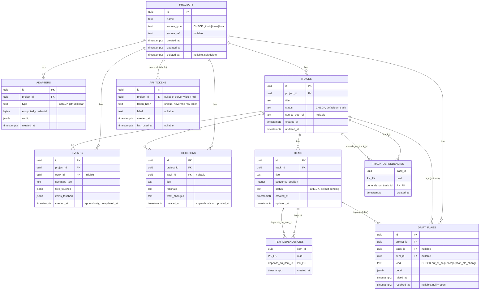

# KnoTrack Database Schema

KnoTrack is a self-hosted, Postgres-backed MCP server. This document describes the
schema created by [`migrations/001_init.sql`](../migrations/001_init.sql) (reversed by
[`migrations/001_init.down.sql`](../migrations/001_init.down.sql)).

- Engine: PostgreSQL 13+
- Migration tool: a small custom runner (`scripts/migrate.ts`) over plain numbered
  raw-SQL files (`001_init.sql` / `001_init.down.sql` is one up/down migration pair) —
  not `node-pg-migrate`; an earlier draft of this doc named that tool, but it was never
  added as a project dependency. See `docs/TRD.md` §1 and `scripts/migrate.ts`'s header
  comment for why.
- Primary keys: `uuid`, generated with `gen_random_uuid()` (from the `pgcrypto`
  extension, enabled by the migration)
- Timestamps: `timestamptz`, `created_at`/`updated_at` default to `now()`

## Contents

- [Entity-relationship diagram](#entity-relationship-diagram)
- [Cross-cutting decisions](#cross-cutting-decisions)
  - [Enum vs. text + CHECK](#enum-vs-text--check)
  - [Soft delete vs. hard delete for projects](#soft-delete-vs-hard-delete-for-projects)
  - [Append-only tables](#append-only-tables)
- [Table reference](#table-reference)

## Entity-relationship diagram



Notes on the diagram:

- `TRACK_DEPENDENCIES` and `ITEM_DEPENDENCIES` are self-referential join tables (a
  track/item can depend on another track/item of the same kind). Mermaid's `erDiagram`
  can't natively draw a table referencing the *same* entity twice with different
  meanings on a single relationship line, so each is shown as two labeled edges
  (`track_id` and `depends_on_track_id`) into the same join table.
- Every edge from `PROJECTS`/`TRACKS`/`ITEMS` into a dependent table is drawn `||--o{`
  (one-to-many, child side optional) because a project/track/item can have zero
  matching child rows.

## Cross-cutting decisions

### Enum vs. text + CHECK

Every enumerated column (`source_type`, `adapters.type`, `tracks.status`,
`items.status`, `drift_flags.kind`) is implemented as **`text` with a `CHECK`
constraint**, not a native Postgres `CREATE TYPE ... AS ENUM`. This choice is applied
consistently across the whole schema. Reasoning:

- **Adding a new value is a plain, transaction-safe `ALTER TABLE ... DROP CONSTRAINT /
  ADD CONSTRAINT`.** Adding a value to a native enum (`ALTER TYPE ... ADD VALUE`) could
  not run inside the same transaction as other DDL on older Postgres versions (pre-12)
  and still cannot be rolled back within the transaction that added it on any version —
  a real hazard for a migration tool that wraps each migration in a transaction.
- **node-pg-migrate and most Postgres client libraries (`pg`, `node-postgres`) return
  enum values as plain strings anyway**, so there's no type-safety loss in application
  code — the CHECK constraint gives the same runtime guarantee at the database layer.
- **Simpler tooling story**: introspection, ORMs, and ad-hoc `psql`/GUI clients treat
  `text` uniformly; native enums require special-casing in schema-diffing and
  code-generation tools.
- The tradeoff accepted: a `CHECK` constraint doesn't restrict values already stored in
  a column the way a `USING` cast to an enum type would, and it's marginally less
  compact on disk (`text` vs. the 4-byte enum OID reference). Neither matters at
  KnoTrack's expected scale (single self-hosted deployment per team).

### Soft delete vs. hard delete for projects

**Tension:** Every project-owned child table (`adapters`, `tracks`, `items`, `events`,
`decisions`, `api_tokens`, `drift_flags`) declares `project_id ... ON DELETE CASCADE`,
so that referential integrity is trivial to maintain and a hard `DELETE FROM projects
WHERE id = ...` never leaves orphaned rows. But `events` and `decisions` are explicitly
meant to be an **audit trail** — and a cascading hard delete would make that history
vanish irreversibly along with the project, which defeats the point of keeping it.

**Resolution:** `projects` has a nullable `deleted_at timestamptz` column.
KnoTrack's application code treats "deleting a project" as `UPDATE projects SET
deleted_at = now() WHERE id = ...`, never as a hard `DELETE`, in normal operation:

- All read paths (`kt_get_project_status` and friends) filter `WHERE deleted_at IS
  NULL` (a partial index, `idx_projects_not_deleted`, keeps that filter cheap).
- Audit history (events, decisions) survives a project's soft delete unconditionally,
  because no row is ever removed — it just becomes unreachable through the normal
  "list active projects" path.
- A soft-deleted project can be restored by clearing `deleted_at`, with its full
  history intact.
- The `ON DELETE CASCADE` foreign keys still exist and still work — they are the
  correct behavior for the *rare, deliberate* hard delete: an admin script or an
  operator satisfying a legal erasure request (e.g. GDPR Article 17), where actually
  destroying the audit trail is the intended, informed outcome, not an accident of
  routine project cleanup. That path is intentionally not exposed as a normal MCP tool
  call.

In short: **the schema is built to support hard delete (for the rare case where it's
truly wanted), but the application layer never uses it for routine deletion** — routine
deletion is soft, via `deleted_at`.

### Append-only tables

`events` and `decisions` are append-only by convention: KnoTrack's application code
never issues `UPDATE` against these tables (only `INSERT` and `SELECT`), which is why
neither table has an `updated_at` column — there is nothing to represent, and a
present-but-always-null `updated_at` would misleadingly imply mutability.

This is enforced by convention plus code review, not by the schema itself, because the
default `node-pg-migrate`-managed role needs `UPDATE` for the rest of the schema and
Postgres privileges are granted per-table, not per-statement-in-application-code. For a
deployment that wants the invariant enforced at the database level (e.g. to limit the
blast radius of a bug or a compromised application credential), revoke `UPDATE` on
these two tables from the role the application connects as:

```sql
REVOKE UPDATE ON events, decisions FROM knotrack_app;
```

(Substitute your actual application role name. This statement is documented here and
left commented out in `001_init.sql` rather than executed unconditionally, since the
role name is deployment-specific and the statement would fail the migration on a fresh
database where that role doesn't exist yet.) `INSERT` and `SELECT` remain granted; only
`UPDATE` is revoked. `DELETE` is a separate privilege and is out of scope for this
invariant — cascading deletes from a hard project delete still need it.

## Table reference

### `projects`

The top-level entity: one row per tracked codebase/initiative.

| Column | Type | Constraints | Notes |
|---|---|---|---|
| `id` | `uuid` | PK, default `gen_random_uuid()` | |
| `name` | `text` | `NOT NULL` | |
| `source_type` | `text` | `NOT NULL`, `CHECK IN ('github','linear','local')` | See [Enum vs. text + CHECK](#enum-vs-text--check) |
| `source_ref` | `text` | nullable | Repo URL, Linear project ID, or local filesystem path, depending on `source_type` |
| `created_at` | `timestamptz` | `NOT NULL DEFAULT now()` | |
| `updated_at` | `timestamptz` | `NOT NULL DEFAULT now()` | Auto-maintained by `trg_projects_set_updated_at` |
| `deleted_at` | `timestamptz` | nullable | `NULL` = active. See [Soft delete](#soft-delete-vs-hard-delete-for-projects) |

**Indexes:** `idx_projects_not_deleted` — partial index on `(id) WHERE deleted_at IS
NULL`, backing the "active projects" filter every read path applies.

### `adapters`

Zero or more per project; each adapter connects the project to an external source
(GitHub, Linear) for pulling/pushing state.

| Column | Type | Constraints | Notes |
|---|---|---|---|
| `id` | `uuid` | PK, default `gen_random_uuid()` | |
| `project_id` | `uuid` | `NOT NULL`, FK → `projects.id`, `ON DELETE CASCADE` | |
| `type` | `text` | `NOT NULL`, `CHECK IN ('github','linear')` | |
| `encrypted_credential` | `bytea` | `NOT NULL` | Ciphertext of the PAT/API key; encryption/decryption happens in application code, never in SQL. The database never sees a plaintext credential. |
| `config` | `jsonb` | `NOT NULL DEFAULT '{}'` | e.g. `{"owner": "acme", "repo": "widgets"}` for GitHub, `{"team_id": "..."}` for Linear |
| `created_at` | `timestamptz` | `NOT NULL DEFAULT now()` | |

**Constraints:** `uq_adapters_project_type` — `UNIQUE (project_id, type)`: at most one
adapter of a given type per project.

**Indexes:** `idx_adapters_project_id` on `(project_id)`.

**ON DELETE reasoning:** `CASCADE` — an adapter has no meaning independent of its
project; if the project is (hard-)deleted, its adapters (and their encrypted
credentials) should go with it. Adapters carry no audit-trail role, so cascading here
doesn't touch the tension discussed above.

### `tracks`

A track is a coherent unit of work within a project (roughly: an epic/initiative).

| Column | Type | Constraints | Notes |
|---|---|---|---|
| `id` | `uuid` | PK, default `gen_random_uuid()` | |
| `project_id` | `uuid` | `NOT NULL`, FK → `projects.id`, `ON DELETE CASCADE` | |
| `title` | `text` | `NOT NULL` | |
| `status` | `text` | `NOT NULL DEFAULT 'on_track'`, `CHECK IN ('on_track','pivot_pending','blocked','done')` | |
| `source_doc_ref` | `text` | nullable | e.g. a design doc URL or Linear project/issue reference the track was derived from |
| `created_at` | `timestamptz` | `NOT NULL DEFAULT now()` | |
| `updated_at` | `timestamptz` | `NOT NULL DEFAULT now()` | Auto-maintained by `trg_tracks_set_updated_at` |

**Indexes:** `idx_tracks_project_id` on `(project_id)`.

**ON DELETE reasoning:** `CASCADE` from `projects` — a track cannot outlive its
project. (A track *itself* being deleted independently of its project is handled
gracefully by `items`/`events`/`decisions`/`drift_flags` below via `SET NULL`, not
`CASCADE`, where those tables are audit trail.)

### `track_dependencies`

Models "track A can't be considered done/unblocked until track B is" as a directed
edge. Composite primary key; no surrogate `id`, since the pair *is* the identity of the
row.

| Column | Type | Constraints | Notes |
|---|---|---|---|
| `track_id` | `uuid` | PK (composite), FK → `tracks.id`, `ON DELETE CASCADE` | The dependent track |
| `depends_on_track_id` | `uuid` | PK (composite), FK → `tracks.id`, `ON DELETE CASCADE` | The prerequisite track |
| `created_at` | `timestamptz` | `NOT NULL DEFAULT now()` | |

**Constraints:** `ck_track_dependencies_no_self_dep` — `CHECK (track_id <>
depends_on_track_id)`, preventing a track from depending on itself at the row level.

**Cycle prevention:** A `CHECK` constraint can only see the row being inserted, so it
can block direct self-dependency (`A → A`) but **cannot** detect or prevent a
multi-hop cycle (`A → B → C → A`). Cycle detection across the whole dependency graph is
the application's responsibility (a graph walk before insert, or a periodic
consistency check) — this is a deliberate limitation of the schema, not an oversight.

**Indexes:** the composite PK already indexes `(track_id, depends_on_track_id)` (and
therefore serves "what does track X depend on" lookups). `idx_track_dependencies_depends_on`
on `(depends_on_track_id)` additionally serves the reverse direction — "what depends on
track Y" — needed when a track's status changes and dependents must be notified/re-evaluated.

### `items`

An item is a step within a track — the unit of sequenced, actionable work.

| Column | Type | Constraints | Notes |
|---|---|---|---|
| `id` | `uuid` | PK, default `gen_random_uuid()` | |
| `track_id` | `uuid` | `NOT NULL`, FK → `tracks.id`, `ON DELETE CASCADE` | |
| `title` | `text` | `NOT NULL` | |
| `sequence_position` | `integer` | `NOT NULL` | Defines ordering within the track. Not declared `UNIQUE` per track: reordering is a common operation and application code is expected to renumber/compact positions rather than rely on the database to reject duplicates, which would make reordering multi-step and race-prone. |
| `status` | `text` | `NOT NULL DEFAULT 'pending'`, `CHECK IN ('pending','in_progress','done','blocked')` | |
| `created_at` | `timestamptz` | `NOT NULL DEFAULT now()` | |
| `updated_at` | `timestamptz` | `NOT NULL DEFAULT now()` | Auto-maintained by `trg_items_set_updated_at` |

**Indexes:**
- `idx_items_track_id` on `(track_id)`.
- `idx_items_track_id_sequence_position` on `(track_id, sequence_position)` — the
  "fetch this track's items in order" query is common (rendering a track, computing
  the next actionable item) and this composite index serves it directly without a sort.

**ON DELETE reasoning:** `CASCADE` from `tracks` — an item has no meaning independent
of its track.

### `item_dependencies`

Same shape and reasoning as `track_dependencies`, one level down: item A can't start
until item B is done.

| Column | Type | Constraints | Notes |
|---|---|---|---|
| `item_id` | `uuid` | PK (composite), FK → `items.id`, `ON DELETE CASCADE` | The dependent item |
| `depends_on_item_id` | `uuid` | PK (composite), FK → `items.id`, `ON DELETE CASCADE` | The prerequisite item |
| `created_at` | `timestamptz` | `NOT NULL DEFAULT now()` | |

**Constraints:** `ck_item_dependencies_no_self_dep` — `CHECK (item_id <>
depends_on_item_id)`. Same multi-hop-cycle caveat as `track_dependencies`: full cycle
prevention is application-level.

**Indexes:** composite PK covers `(item_id, depends_on_item_id)`;
`idx_item_dependencies_depends_on` on `(depends_on_item_id)` covers the reverse
direction.

### `events`

**Append-only** audit-trail row recording an observed change (e.g. "adapter poll found
these files changed and these items touched"). See
[Append-only tables](#append-only-tables).

| Column | Type | Constraints | Notes |
|---|---|---|---|
| `id` | `uuid` | PK, default `gen_random_uuid()` | |
| `project_id` | `uuid` | `NOT NULL`, FK → `projects.id`, `ON DELETE CASCADE` | |
| `track_id` | `uuid` | nullable, FK → `tracks.id`, `ON DELETE SET NULL` | An event may not be attributable to a single track |
| `summary_text` | `text` | `NOT NULL` | Human-readable summary, typically model-generated |
| `files_touched` | `jsonb` | `NOT NULL DEFAULT '[]'` | Array of file path strings |
| `items_touched` | `jsonb` | `NOT NULL DEFAULT '[]'` | Array of item `id` strings |
| `created_at` | `timestamptz` | `NOT NULL DEFAULT now()` | No `updated_at` — see [Append-only tables](#append-only-tables) |

**Indexes:** `idx_events_project_id` on `(project_id)`, `idx_events_track_id` on
`(track_id)`.

**ON DELETE reasoning — the tension called out explicitly:** `project_id` is
`CASCADE` (see [Soft delete](#soft-delete-vs-hard-delete-for-projects) for why that's
safe in practice: routine project deletion is soft, so this cascade only fires on a
deliberate hard delete). `track_id`, by contrast, is `SET NULL`, not `CASCADE` —
deleting an individual track (independent of its project) is a normal, expected
operation, and doing so must not silently destroy event history. The event survives
with `track_id = NULL`, still attached to its project.

`files_touched`/`items_touched` are `jsonb` arrays rather than normalized join tables
(e.g. an `event_files` table) because they are immutable, write-once, and read as a
whole alongside the event — normalizing them would add join overhead for a access
pattern that never filters or aggregates by individual file/item across events at the
SQL layer (that kind of query, if ever needed, is expected to go through
`items_touched`'s item IDs against the `items` table, not the raw JSON).

### `decisions`

**Append-only** audit-trail row recording a deliberate decision (e.g. "we chose to
pivot track X because Y"). Structurally near-identical to `events`; kept as a separate
table because a decision has different fields (`rationale`, `what_changed`) and a
different semantic weight (deliberate/curated vs. observed/automatic) — collapsing
them into one polymorphic table would blur that distinction in queries and in the tool
surface (`kt_record_event` vs. `kt_record_decision`).

| Column | Type | Constraints | Notes |
|---|---|---|---|
| `id` | `uuid` | PK, default `gen_random_uuid()` | |
| `project_id` | `uuid` | `NOT NULL`, FK → `projects.id`, `ON DELETE CASCADE` | |
| `track_id` | `uuid` | nullable, FK → `tracks.id`, `ON DELETE SET NULL` | Same reasoning as `events.track_id` |
| `title` | `text` | `NOT NULL` | |
| `rationale` | `text` | nullable | Why the decision was made |
| `what_changed` | `text` | nullable | What concretely changed as a result |
| `created_at` | `timestamptz` | `NOT NULL DEFAULT now()` | No `updated_at` — append-only |

**Indexes:** `idx_decisions_project_id` on `(project_id)`, `idx_decisions_track_id` on
`(track_id)`.

**ON DELETE reasoning:** identical to `events` — `CASCADE` on `project_id`, `SET NULL`
on `track_id`.

### `api_tokens`

Bearer tokens for authenticating MCP clients against this KnoTrack server.

| Column | Type | Constraints | Notes |
|---|---|---|---|
| `id` | `uuid` | PK, default `gen_random_uuid()` | |
| `project_id` | `uuid` | nullable, FK → `projects.id`, `ON DELETE CASCADE` | `NULL` = server-wide token (valid across all projects); non-null = scoped to that one project |
| `token_hash` | `text` | `NOT NULL`, `UNIQUE` | A hash (e.g. SHA-256) of the bearer token — **never** the raw token itself. The raw token is shown to the operator exactly once at creation time and is not recoverable from the database. |
| `label` | `text` | nullable | Free-text description of which client/device/CI job holds this token |
| `created_at` | `timestamptz` | `NOT NULL DEFAULT now()` | |
| `last_used_at` | `timestamptz` | nullable | Updated by application code on successful auth; `NULL` means never used |

**Constraints:** `uq_api_tokens_token_hash` — `UNIQUE (token_hash)`, which also
provides the index backing every authentication lookup (`SELECT ... WHERE token_hash =
$1`), the hottest query this table serves.

**Indexes:** `idx_api_tokens_project_id` on `(project_id)`, for the "list a project's
tokens" admin view.

**ON DELETE reasoning:** `CASCADE` on `project_id` when set — a project-scoped token
has no purpose once its project is gone. Server-wide tokens (`project_id IS NULL`) are
unaffected by any project's deletion, by construction.

### `drift_flags`

Flags raised automatically when observed reality (from adapter polling) diverges from
tracked state — e.g. a file changed that isn't linked to any known item
(`orphan_file_change`), or work happened on an item out of its declared sequence
(`out_of_sequence`).

| Column | Type | Constraints | Notes |
|---|---|---|---|
| `id` | `uuid` | PK, default `gen_random_uuid()` | |
| `project_id` | `uuid` | `NOT NULL`, FK → `projects.id`, `ON DELETE CASCADE` | |
| `track_id` | `uuid` | nullable, FK → `tracks.id`, `ON DELETE SET NULL` | |
| `item_id` | `uuid` | nullable, FK → `items.id`, `ON DELETE SET NULL` | |
| `kind` | `text` | `NOT NULL`, `CHECK IN ('out_of_sequence','orphan_file_change')` | |
| `detail` | `jsonb` | `NOT NULL DEFAULT '{}'` | Structured detail specific to `kind` (e.g. the offending file path, or the expected vs. actual sequence position) |
| `raised_at` | `timestamptz` | `NOT NULL DEFAULT now()` | |
| `resolved_at` | `timestamptz` | nullable | `NULL` = still open. Set once a human or automated process resolves the flag. |

**Indexes:**
- `idx_drift_flags_project_id` on `(project_id)`
- `idx_drift_flags_track_id` on `(track_id)`
- `idx_drift_flags_item_id` on `(item_id)`
- `idx_drift_flags_open_by_project` — **partial** index on `(project_id) WHERE
  resolved_at IS NULL`. This is the hot path: `kt_get_project_status` needs "open
  drift flags for project X" on effectively every call. A partial index only covers
  currently-open flags, so it stays small and fast even as a long-lived project
  accumulates thousands of historically-resolved flags — the full-table index on
  `project_id` would keep growing and get progressively less selective for this exact
  query, while the partial index's size tracks only the (much smaller, bounded-in-
  practice) count of currently-open flags.

**ON DELETE reasoning:** `track_id`/`item_id` are `SET NULL` (not `CASCADE`) for the
same audit-trail-preservation reason as `events`/`decisions`: a drift flag, especially
a *resolved* one, is a historical record; deleting the track or item it pointed at
shouldn't delete the record that drift was ever detected there. `project_id` is
`CASCADE`, consistent with every other project-owned child table (and, as elsewhere,
safe in practice because routine project removal is soft-delete, not hard-delete).
